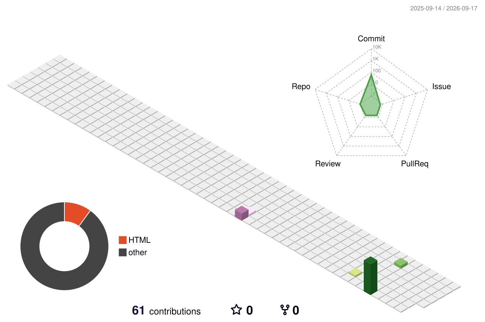

## 🎮 CHARACTER SELECT

<table>
<tr>

<td width="220" align="center">

 

<b>VIPUL_MINZ.exe</b>

 

⭐⭐⭐⭐⭐

</td>

<td>

Name:        Vipul Minz
Class:       Full-Stack Wizard / UI-UX Artificer
Guild:       NIT Rourkela
Rank:        M.Tech Candidate
Side Quest:  Freelance UI/UX Designer
Origin:      Building the future, one line of code at a time.
Play Style:  Nocturnal (peak power after 22:30)

HP ☕☕☕☕☕☕☕☕░░ 80/100 (coffee-dependent)
MP 🔥🔥🔥🔥🔥🔥🔥🔥🔥░ 90/100 (focus meter)
LUCK 🍀🍀🍀🍀🍀░░░░░ 50/100 (deploy on Friday odds)

</td>

</tr> </table>

## 🗡️ SKILL TREE

## 🧰 INVENTORY

## 🏆 ACHIEVEMENTS UNLOCKED

## 📜 QUEST LOG

✅ Complete M.Tech coursework — NIT Rourkela • ✅ Ship freelance UI/UX projects • 🚧 Open-source a component library • 🎯 Reach 1,000 GitHub contributions • 📚 Learn a new stack

## 🐍 THE ACTUAL GAME: Snake Eats My Contributions

## 🧊 3D CONTRIBUTION MAP

## 📊 STATS HUD

  
  

## 📈 ACTIVITY GRAPH

## 🌐 CONNECT / MULTIPLAYER

